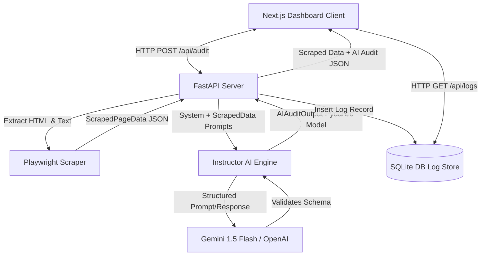

# Enterprise Website Audit Tool

A professional-grade, single-page SEO crawler and AI-driven audit engine designed for digital agencies. It provides deep analytical insights and prioritized recommendations grounded strictly in factual website metrics.

## Architecture

The following diagram illustrates the data flow and system architecture:



## AI Architecture

The audit engine follows a **three-stage AI pipeline** with full traceability:

```
Scrape (Playwright) → Analyze (Instructor + Pydantic) → Persist (SQLite/PostgreSQL)
```

| Module | Role |
|--------|------|
| `app/pipeline.py` | Orchestrates scrape → analyze → persist |
| `app/prompt_registry.py` | File-backed prompts from `prompts/` with schema guardrails |
| `app/ai_engine.py` | LLM gateway with structured output + chat + retries |
| `app/config.py` | Centralized env config (CORS, models, DB) |

Every audit stores system prompt, user prompt, scraped snapshot, and structured JSON response for the **Audit Insight** trace view.

---


When conceiving this tool, I established two core architectural pillars: **data integrity** and **auditability**.

1. **Data Integrity (via Pydantic & Instructor)**:
   In enterprise systems, relying on loose JSON or raw markdown responses from large language models is a major liability. I prioritized structural validity by wrapping the LLM call with **Instructor** and **Pydantic**. This forces the model to respect our strict types (e.g., scoring bounds, priority scales, structured grounding objects) and automatically handles validation. If the LLM generates a malformed response, the schema parser rejects it at the boundaries, protecting the frontend from runtime visualization crashes.

2. **Auditability (via Persistent Logging)**:
   AI systems must not operate in a black box. To ensure strict quality control and easy prompt engineering iteration, I built a persistent prompt-logging mechanism at the core. Every single prompt (both system instructions and user-rendered scrapings) is saved alongside the exact structured JSON response in a persistent SQLite store (ready to scale to PostgreSQL or MongoDB). The dashboard exposes a "Debug View" containing these logs, enabling us to trace exactly *why* a particular recommendation was given and *how* the prompt was formatted.

---

## Trade-offs

### Single-Page Depth vs. Multi-Page Crawling

For this enterprise audit tool, we consciously chose a **single-page analysis depth** instead of a multi-page crawler:

* **Speed & Real-time Delivery**: Playwright scraping is computationally expensive. Multi-page crawling introduces significant network lag and token overhead. Focusing on a single high-intent page allows us to deliver a complete audit within seconds.
* **Contextual Quality**: General crawlers gather shallow metrics across thousands of pages. By focusing on a single page, we can extract granular details (such as full heading hierarchies, complete alt-text coverage, and specific button-by-button Call-To-Action counts) to feed high-fidelity context to the LLM.
* **Cost Efficiency**: Auditing an entire website of thousands of pages would balloon LLM token usage. A targeted single-page audit allows developers to optimize high-impact landing pages or templates individually without wasting thousands of dollars on duplicate template audits.

### What Would You Improve With More Time

Given additional time, the following improvements would be prioritized:
1. **Dynamic Authentication for Scraper**: Allow the Playwright scraper to accept login credentials or cookies to audit pages behind authentication walls.
2. **Streaming AI Responses**: Implement Server-Sent Events (SSE) to stream the AI output to the frontend. This would significantly reduce the perceived wait time for the user during the pass-1 and pass-2 LLM inferences.
3. **Advanced Visual Analysis**: Use the multimodal capabilities of `gpt-4o` or `gemini-1.5-pro` by sending a full-page screenshot (captured via Playwright) to the model alongside the DOM metrics. This would allow the AI to detect visual hierarchy, contrast issues, and layout bugs.
4. **Export Capabilities**: Add functionality to export the final audit report directly to PDF or CSV for agency client presentations.

### Prompt Logs / Reasoning Traces

Detailed visibility into how the AI layer is structured, including the exact **System Prompts**, **User Prompts**, and **Structured Schemas** used for inference, is available in the [`Prompt_Logs.md`](./Prompt_Logs.md) file included in the root of this repository.

---

## Local Setup & Installation

### Prerequisites
- Python 3.11+
- Node.js 20+
- An API Key (`GEMINI_API_KEY` or `OPENAI_API_KEY`)

### Backend Setup
1. Change directory to `/backend`:
   ```bash
   cd backend
   ```
2. Create and activate a virtual environment:
   ```bash
   python -m venv venv
   source venv/bin/activate  # On Windows: venv\Scripts\activate
   ```
3. Install dependencies:
   ```bash
   pip install -r requirements.txt
   playwright install chromium
   ```
4. Set your environment variable:
   ```bash
   export GEMINI_API_KEY="your-key-here"
   # or: export OPENAI_API_KEY="your-key-here"
   ```
5. Run the FastAPI server:
   ```bash
   python run.py
   ```
   The backend will be running on `http://localhost:8000`.

### Frontend Setup
1. Change directory to `/frontend`:
   ```bash
   cd ../frontend
   ```
2. Install dependencies:
   ```bash
   npm install
   ```
3. Set the API URL (defaults to `http://localhost:8000` if omitted):
   ```bash
   export NEXT_PUBLIC_API_URL=http://localhost:8000
   ```
4. Start the Next.js development server:
   ```bash
   npm run dev
   ```
   The dashboard will be running on `http://localhost:3000`.

### Docker Compose (recommended for deployment)
From the repo root, copy `template.env` to `.env`, fill in API keys, then:
```bash
docker compose up --build
```
- Backend: `http://localhost:8000`
- Frontend: `http://localhost:3000`
- Health check: `GET /api/health`

### CLI Testing Utility
You can test the scraper and AI audit logic directly from the command line using:
```bash
python scripts/test_audit.py https://example.com
```

---

## Docker Deployment

Both services are ready for AWS App Runner or ECS deployment.

- **Backend Dockerfile**: Installs system requirements for headless Chromium, configures Playwright, and starts the FastAPI server.
- **Frontend Dockerfile**: Uses a multi-stage build, leveraging Next.js `standalone` mode to output a highly compressed production runtime.
